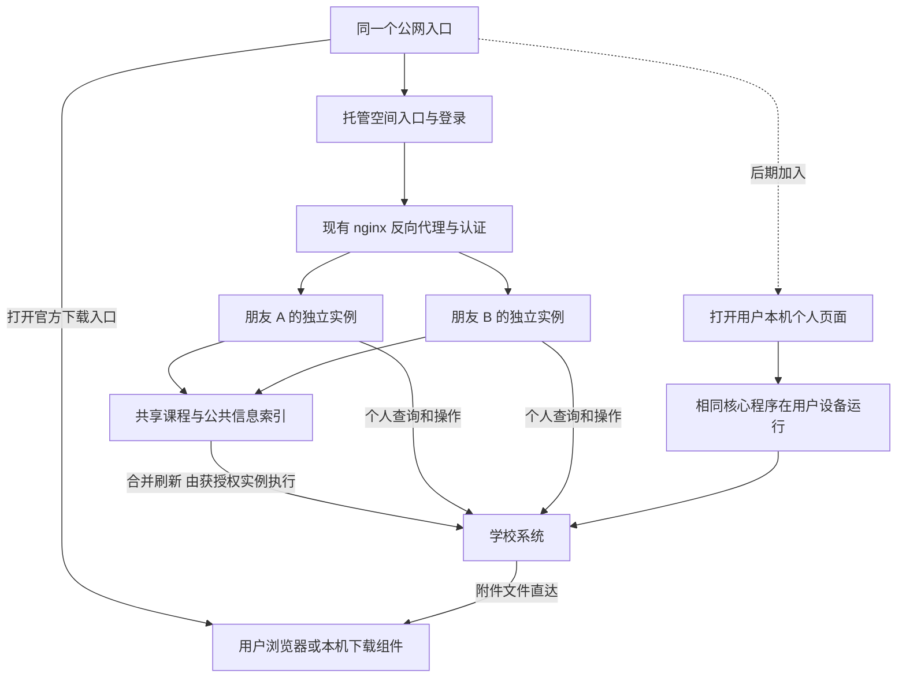

# Web 托管试用计划与双模式路线

日期：2026-10-07。状态：第一阶段已按本计划实施；当前交付、验收证据与运行版本见 [托管第一阶段交付记录](HOSTED-PHASE1.md)。本文保留路线与验收合同，实施前的源码观察作为历史基线阅读。

本文是路线和第一阶段计划的检索入口。复用与下载的详细规则见 [共享索引与直达下载](SHARED-METADATA-AND-DOWNLOADS.md)；后续方案三只保留必要衔接信息，见 [本机模式衔接说明](LOCAL-MODE-HANDOFF.md)。具体实现状态以交付记录为准。

## 1. 用户思路与可行性结论

### 已确认的方向

- 前期只邀请少数身边朋友，先提供方案一：打开公网网站即可使用的云端托管模式。
- 在现有项目上增量改造，复用现有课程、作业、预约、资料、教务等业务逻辑。
- 后期增加方案三：公共功能在公网，个人功能交给用户安装的本机组件执行。
- 两种模式长期兼容，用户根据便利性和对运营者的信任程度选择；增加方案三不强制撤销方案一。
- 两种模式共用公网入口与产品界面体系。用户本人仍可在自己的常开服务器上运行个人实例。
- 跨用户可复用的课程和公共信息应尽量只查询、维护一份；重复抓取与重复存储是第一阶段重点优化和验收项。
- 附件与文件从学校原站直接下载到用户本机，云端不保存再分发。为减轻云端压力，采用原站直连，复用集中于元数据与索引，不建设云端附件池。
- 初始规划交付为思路整理、资料核验和计划记录；随后用户已要求实施第一阶段。

### 判断及条件

路线可行。当前程序已经采用“一位使用者、一个进程、一个数据目录”，适合先把多个个人实例部署到运营者服务器，再把同一种个人实例部署到用户设备。依据新增的复用要求，方案一应为“个人实例＋受控共享元数据层”：私密状态独立，获准共享的课程内容和目录索引集中维护，附件本体原站直达用户设备。

“不会影响后续转化”需要落实为设计约束，不能承诺零成本迁移：第一阶段就要保持个人实例独立、业务代码共用、数据可导出、执行位置明确；后期仍需做组件安装连接、版本兼容和迁移验收。

“共用公网 Web 页面”存在两种含义，必须区分：

- 共用网址入口、导航、功能布局、组件源码和视觉风格：可行，建议采用。
- 所有个人数据始终交给同一个公网页面的脚本显示：可行，但该网站的维护者能通过更新脚本取得数据，不能同时承诺运营方无法接触明文。

本计划按第一种解释预留强隐私路线：公网入口打开本机提供的个人页面。是否接受个人页使用本机地址，保留为方案三实施前的产品决定。仅换 URL 路径不是浏览器安全隔离。[R5]

## 2. 两种模式的准确含义

### 方案一：运营者托管

- 用户无需安装程序，经过邀请开通后在浏览器绑定自己的 CAS 账号。
- 个人查询、状态与定时任务在运营者服务器上的个人实例内完成；可共享元数据通过统一索引与合并刷新复用。附件下载由用户浏览器或本机组件直连学校完成。
- 为支持持续同步，可按清楚告知后的选择保存加密凭据。服务器运行时能解密使用，运营者仍有技术上的访问能力。
- “相信运营者”不免除用户之间隔离、HTTPS、会话保护、日志脱敏等基本要求。
- 各用户的课程归属、基线、会话、附件任务、写操作记录独立；课程的公共字段与附件索引可在验证权限后引用同一份。朋友不能获得拥有者的账号或未授权个人信息。

### 方案三：用户设备执行

- 同一个公网入口提供公共信息、下载、帮助和模式选择。
- 用户安装组件后，由其电脑或自己的服务器直接连接学校，保存凭据和个人数据。
- 强隐私个人页面和脚本随组件发布，由个人运行端提供；公共网站不读取个人 JSON，不接收学校会话。
- 用户设备必须开机联网才能执行任务；自己的常开服务器可以承担持续任务。
- 强隐私是运行和数据边界，不是对未来发布代码无恶意的绝对证明；签名更新、源码审阅与更新选择仍然重要。

## 3. 当前代码证据

检查基线：本地 Git 提交 `0178a1b`，软件版本 `0.2.2`；检查开始时工作树干净。本次未探测线上服务或朋友账号，以下是代码与现有文档事实。

本轮收尾时出现并行的 `0.2.3` 打印代理/中继改动，尚未提交；本轮未修改或验收这些代码。开始实施托管前应重新核对最终合入版本，把新增的代理、任务队列与设备绑定一起纳入用户隔离。

- [paths.py](../src/sustech_dashboard/paths.py)：`DATA_ROOT` 在模块加载时确定；模块说明即为一人一进程一目录。
- [authentication.py](../src/sustech_dashboard/authentication.py)：`cred_set()` 设置上游进程凭据；清理时操作 `Authorizer._instances`。已安装的固定版上游另有 `_IN_MEMORY_CREDS` 全局变量。因此同一工作进程不能通过逐请求换账号承载多位用户。
- [app.py](../src/sustech_dashboard/app.py)：快照、附件基线、材料数据库是当前实例的全局路径。
- 当前附件扫描和锁仅在单实例内生效；`/api/attachment` 与 `download_agent.py` 仍采用云端文件转发，尚不符合新要求，须分别补共享元数据协调和本机直连下载。
- [runtime.py](../src/sustech_dashboard/runtime.py)：每个运行实例启动自己的同步、资料扫描和可选下载工作线程。
- [web_auth.py](../src/sustech_dashboard/web_auth.py)：已有单账号网页认证、持久会话、密码哈希、注销和登录限流，可复用；并不是现成的多人账号中心。
- [instance_routes.py](../src/sustech_dashboard/instance_routes.py)：现有云端模式禁止通过 `/api/instance/login` 配置 CAS；托管试用需要新增受控绑定流程，不能直接打开公网表单就宣称完成。
- [static/common.js](../src/sustech_dashboard/static/common.js)：已有 `apiBase` 调用封装，适合复用页面与接口，而非重写为另一套应用。
- [UPDATING.md](../UPDATING.md)：已有 Windows/Linux 分发、TUF 签名验证与更新流程。
- [README.md](../README.md)：业务与限制的现役说明。讨论间后台监控已撤销；本轮不恢复。打印仍受校园网/VPN可达性限制。

部署目录中的旧 service 文件与 README 的发布包路径有差异。实施前应读取实际生效的 systemd unit、nginx 配置和运行版本；不能把某份旧模板当作线上事实。

## 4. 第一阶段架构建议

### 4.1 采用独立实例承载少量朋友

- 优先复用 Linux systemd 模板服务、nginx 和现有 Python 应用；第一阶段不引入 Kubernetes、分布式消息队列或重写整套多人业务数据库。
- 每人分配不含学号的随机实例 ID、独立 Linux 用户、进程、数据目录、数据库、凭据、会话、临时目录及资源限额。
- 相同只读程序可以共用；个人会话、权限、进度和可写私密缓存保持隔离。可共享课程元数据由受控服务统一管理，个人实例保存授权引用，不能直接互读对方数据目录。不同 Linux 用户仍共享宿主机，不宣称具备独立虚拟机级别的隔离。
- 保留现有拥有者的 `/campus/`、个人数据与下载代理；新增托管路由。示意为 `/app/` 公共入口和 `/spaces/<id>/` 私人空间，最终 URL 由部署核验后确定。
- 优先复用每实例网页认证；入口只负责导航与邀请开通。少量朋友由维护命令创建实例，不先建设庞大的自助云平台。
- 随机 ID 只用于定位空间，不能代替认证。请求必须在目标实例验证其自己的会话；A 的 Cookie、任务 ID 或操作令牌不能访问 B。相同附件 ID 也不能替代对该资源的权限核验。
- 后端仅在私有监听端点提供服务，且不能因为请求来自回环地址就绕过认证。nginx 覆盖外部伪造的代理头，只转发预先登记的目标，不接收任意后端 URL。[R2][R3][R6]
- 按路径部署便于复用现有代理前缀，但路径不是浏览器隔离边界；学校 HTML 和上传文件必须安全呈现，禁止在同源页面执行不可信内容。[R5]

这属于“个人实例隔离＋共享元数据”的混合托管方式。独立实例保留现有凭据边界，共享层消除能安全合并的重复读取与存储。官方资料描述了独立租户部署的取舍，但不意味着所有内容都应每人复制，也不构成大量用户的容量保证。[R1]

### 4.2 保留可迁移的核心

- 核心仍处理一个人的校园业务，托管模式增加实例开通和生命周期管理。
- 明确区分 `local`、`personal_server`、`hosted` 三类执行环境；命名为建议值，实施时保持旧配置兼容。网络位置和凭据所有权不能都依赖一个 `CLOUD` 布尔值判断。
- 学校业务代码不依赖公网账号数据库；实例标识也不等于 CAS 学号。
- 将凭据取得方式、存储目录、下载目的地和更新权限收敛到少量边界，避免在每个功能中重复分支。
- 两种模式共用业务接口和模板，个人实例独立加载模板。无需为了“共用前端”先换成 SPA。

### 4.3 将复用与直达下载作为第一阶段必做项

- 按学校、学期、官方课程/资源 ID、可见范围及版本复用元数据；公共主表加个人引用，避免给每位用户复制整套课程信息。
- 跨进程合并同一资源的刷新，配合有效期、条件请求、版本失效和退避；同一课程的个人可见性、截止例外、成绩与提交状态仍逐人核验。
- 云端仅管理有容量上限的索引、引用和状态；附件本体不进数据库、缓存、临时文件、备份或云端分发链路。
- 下载入口优先打开学校正式地址；需要学校浏览器会话时引导在学校登录。自动归档到本机可采用可选本机组件，不能用云端存储/转发作为回退。
- 机制、现有代码差距、存储清理和量化验收统一见 [共享索引与直达下载](SHARED-METADATA-AND-DOWNLOADS.md)，实现前必须按该文档检查。

## 5. 第一阶段实施顺序与验收

以下为第一阶段实施顺序与验收要求；逐项实现和验证结果见交付记录。

### P0：确认运行基线与范围

- 读取线上实际部署、TLS、反向代理、服务账户、磁盘与资源使用；核对源码、发布包和运行版本。
- 对拥有者现有数据、基线、操作记录与配置做一致性备份并验证可恢复；数据库不能直接在写入中随意复制。
- 列出托管试用功能：已有概览、课程/作业、预约、附件、成绩、课表、教务等继续复用；网络受限功能明确标注。
- 确认试用人数、元数据容量与保留规则，并验证学校直达下载入口及浏览器登录要求。附件不在云端保存已锁定，不再作为可选方案。
- 验收：形成可回滚部署清单；当前个人实例可正常读取，新增空间不复用其私密状态；共享范围和学校直达下载能力都有明确核验结果。

### P1：实例部署与访问隔离

- 新增实例配置、systemd 模板和受约束的部署命令；程序目录只读，数据和密钥逐实例分开。
- 分配独立监听目标、代理前缀、Cookie 范围和会话存储；健康检查只提供必要状态。
- 托管实例不开放修改任意服务器路径、停止他人服务、安装共享程序更新等能力。
- 将代理规则做成可生成、可校验的模板，复用既有认证子请求机制；保留上传上限与认证子请求上限相同的已修复行为。
- 验收：两个隔离的假账号实例并行运行；跨空间 URL、Cookie、下载任务、私密缓存与操作 ID 均不能串用；停止 A 不影响 B。

### P1.5：共享元数据与刷新协调

- 为课程公共字段、教师发布内容和附件索引建立共享对象/版本记录；个人实例只存授权引用与个人差异。
- 通过单机共享服务复用 SQLite 等现有机制，增加跨进程刷新租约、条件请求、更新失效和配额清理；不引入文件本体缓存。
- 首先核验资源的可见范围，不按“选了同一课程”盲目合并；无法安全合并的权限请求和个人目录检查单独保留并如实计数。
- 验收：10 个相同已验证可见范围的 fixture 并发访问，公共内容只执行一轮必要刷新，保存一份公共元数据；个人状态不串用，失效与失败恢复正确。

### P2：邀请开通、面板登录与 CAS 绑定

- 流程：邀请入口 → 设置个人面板访问密码 → 阅读简洁的托管说明 → 绑定自己的 CAS → 首次同步。
- 邀请凭证应随机、限时、单次使用、绑定已分配实例；存储摘要，避免写入日志或发送给第三方页面。
- 面板密码只保存哈希，复用现有会话机制；CAS 不能用不可逆密码哈希替代，因为上游登录需要使用它。
- CAS 绑定仅在已登录、处于允许绑定状态的托管实例开放，保留 Origin/CSRF、登录限流和失败退避；不会放开所有云端实例。
- 持久凭据采用受维护的加密实现。每实例密钥由 systemd credential 等现有机制注入，密文与密钥权限分离，运行时可解密；不通过明文环境变量、日志、进程参数传递密码。[R4]
- 当前 systemd 凭据在服务运行中不可变；浏览器绑定/更换凭据需要新增持久存储适配或受约束的更新流程，不能假设写文件后旧服务会自动读取新密码。[R4]
- 首次绑定可用性验证后才启用同步。更新密码时暂停该实例相关任务并清理旧会话；不允许把同一空间随意切换为另一个 CAS 身份。
- 面板退出仅结束浏览器会话；“断开学校账号”另行停止后台同步并清理保存的学校凭据。页面解释二者差别。
- 验收：邀请重放、错误凭据、进程重启、密码更换、注销、撤销访问均有明确结果；无密码和 Cookie 泄露到日志或错误消息。

### P3：共享刷新、个人任务与文件直达本机

- 个人状态定时器逐实例运行；可共享信息按资源统一刷新，所有实例的手动/自动刷新合并。增加错峰、失败退避与并发上限，避免重复抓取。
- 新用户首次成功扫描建立自己的附件基线，之后才处理新可见附件。绝不复制拥有者的历史 58 项基线、操作记录或下载状态。
- 课程时间范围成为实例配置；拥有者继续保持 2026-09 起的既有行为。朋友范围按其设置确定，不能把个人筛选视为普遍事实。
- 写操作继续由本人在页面确认，沿用一次发送和官方回读；结果不明时不自动重试。托管迁移、重启与恢复也不能重放旧写入。
- 纯 Web 明确区分“已发现新资料”“已打开学校下载入口”和“本机确认保存”；没有浏览器/本机回执时不标记下载成功。
- 朋友使用自动发现新资料＋原站浏览器下载；无人值守写入指定目录采用可选本机组件，在本机认证并直连学校。云端不缓存、不打包、不转发附件。
- 保留拥有者已有下载目录、基线和回执，将原本经过云端的下载代理迁为学校直连；切换完成前明确标记待改造。朋友下载不依赖拥有者电脑或学校会话。
- 打印等校内接口继续按运行端网络可达性显示受限；不会因为改成多人托管就自然获得校园网络权限。
- 若实施时已合入打印中继，打印代理只能处理与当前用户绑定的设备及任务；朋友不能复用拥有者的校园电脑、学校会话或打印队列。
- 验收：共享附件索引可以供有权限的 A/B 引用，各自任务、基线与本机完成状态独立；云端附件字节为 0；断网/重新登录不会重复提交作业或预约。

### P4：运维、退出与部署

- 每实例设置内存、CPU、任务并发和磁盘上限；通过少量实例实测确定接纳人数，不先给出未经验证的容量承诺。
- 公共版本文件与个人数据目录分开；诊断只显示必要状态，默认不记录请求正文、凭据和校园内容。
- 单独列出凭据、共享元数据、个人引用/状态、任务记录和备份的保留规则；云端备份不含下载附件本体。用户离开时撤销会话、停止任务并清理其引用，不能删除其他人仍需的共享元数据。
- 托管更新由运营者统一完成，先试一个实例再逐个更新。普通试用者不能调用现有“安装更新”入口修改共享程序。
- 本机客户端仍使用原有 TUF 机制。数据格式变化需要迁移与恢复策略，代码回退不能冒充数据库可回退。
- 新增朋友实例逐步接入；故障时撤销新增路由并停止对应实例，拥有者原实例继续运行。恢复过程不自动重放学校写操作。
- 验收：升级与回滚演练、备份恢复、访问撤销和配额耗尽验证通过后，才向朋友开放。

## 6. 第一阶段验收重点

- 业务回归：已有测试及真实 Nginx 上传回归；不为了多人模式降低原有写操作校验标准。
- 身份与数据：至少两个隔离 fixture，覆盖串号、错误路由、伪造代理头、下载对象越权、缓存泄露、并发操作和注销后的访问。
- 复用：按资源和请求种类统计源请求、刷新合并数、存储对象数、命中率与版本失效；共享元数据不能随用户数等比例复制。
- 下载与存储：真实网络和磁盘核验附件从学校直达用户设备，云端文件读取/转发/存储均为 0；学校登录、链接失效和浏览器保存限制不能触发云端中转回退。
- 校园接口：fixture 模拟认证失效、超时、重复响应和结果不明；首次真实试用仅由各自账号执行读取和附件下载。
- 不使用朋友真实账号做自动化提交作业、占用场地、选退课或打印测试；真实写入只对应本人主动发起的真实需求。
- 前端：验证邀请、初次绑定、同步状态、未提交作业倒计时、文件目的地、错误与限额提示；后台返回 200 不等于界面验收。
- 兼容：旧个人服务器和 Windows 本机模式继续运行，拥有者数据与下载基线保持；旧监控接口仍为已撤销状态。
- 容量：测试实际资源峰值、重启恢复和单实例故障影响，达到试用目标人数后停止无关扩展测试。

## 7. 现在预留、后期实现

- 现在保持一个核心程序、个人状态逐实例存储、可选共享元数据适配和可配置执行位置，预留模式/能力/数据格式版本信息。
- 现在明确已提交/待核对写操作与普通同步任务不同，迁移时不重放。
- 现在不把 CAS 密码、Cookie、网站会话、加密密钥塞进通用导出包；导出和接收文件均按不可信输入验证。
- 现在保留用户独立基线和可导出的偏好，为后续迁移提供依据。
- 云端共享课程索引不成为方案三的强制依赖；本机模式优先本地复用，不自动上传课程归属来换取跨用户缓存命中。
- 后期再做组件安装引导、本地连接、强隐私页面边界和完整迁移工具；详见 [本机模式衔接说明](LOCAL-MODE-HANDOFF.md)。

## 8. 待决事项与范围状态

- 已锁定：先少量朋友托管试用；后期增加本机模式；两者共存；共用公网入口；复用现有功能；最大化安全的元数据复用；附件原站直达用户本机、云端不存储分发。
- 第一阶段已锁定：首批上限 5 人，共享元数据 256 MiB、私密状态 128 MiB/人，旧元数据最多 2 版/7 天，日志 14 天，已验证恢复备份 7 天。学校附件直达与登录要求已实测；课程目录仍逐人核验权限，仅对已证明一致的范围合并抓取。
- 后期实施前待定：共用入口后允许打开本机个人页，还是坚持个人数据也显示在原公网页面；后者需要降低隐私承诺，不能标作已实现强隐私。
- 独立实例、邀请流程、凭据适配、共享元数据与直达下载已实现；旧个人实例保留，5 个试用空间已准备，未发送邀请。真实双实例隔离、恢复与限额已验收；朋友首次绑定仍由本人完成。
- 本机页面连接与完整迁移工具仍属后续阶段。没有写入全局 Memory 或 RemNote。

## 9. 资料与适用边界

以下资料于 2026-10-07 阅读；用于验证机制与取舍，不代表当前项目已经满足全部要求。

- [R1 AWS：Silo isolation](https://docs.aws.amazon.com/whitepapers/latest/saas-tenant-isolation-strategies/silo-isolation.html)：独立租户部署可以构成统一产品；资源和运维成本是代价。本计划只是借用隔离思路，不要求迁往 AWS，也不宣称共享主机等同完整资源隔离。
- [R2 Nginx：auth_request](https://nginx.org/en/docs/http/ngx_http_auth_request_module.html)：代理可以基于认证子请求结果允许或拒绝访问，适合延续已有部署。
- [R3 OWASP：Multi Tenant Security](https://cheatsheetseries.owasp.org/cheatsheets/Multi_Tenant_Security_Cheat_Sheet.html)：用户归属须由可信认证验证，并延伸到存储、队列、限额和退出清理。
- [R4 systemd：Credentials](https://systemd.io/CREDENTIALS/)：服务凭据可限制可见性并加密交付，运行中不可变；不构成对宿主机管理员不可读的保证。
- [R5 MDN：Same-origin policy](https://developer.mozilla.org/en-US/docs/Web/Security/Defenses/Same-origin_policy)：源由协议、主机和端口决定，不同路径仍同源；用于界定公共入口与个人页面的边界。
- [R6 Flask：反向代理配置](https://flask.palletsprojects.com/en/stable/deploying/proxy_fix/)：代理头可能伪造，只能信任实际部署的代理层。
- [R7 Chrome：Local Network Access](https://developer.chrome.com/blog/local-network-access)：公网网页连接本机服务涉及安全上下文和权限；后期连接方案须按实际浏览器验证。
- [R8 OWASP：Session Management](https://cheatsheetseries.owasp.org/cheatsheets/Session_Management_Cheat_Sheet.html)：会话撤销与 Cookie 作用域的参考，不能仅靠 Cookie 路径充当完整隔离。
